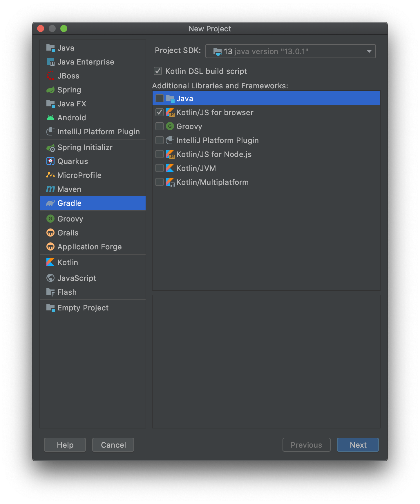
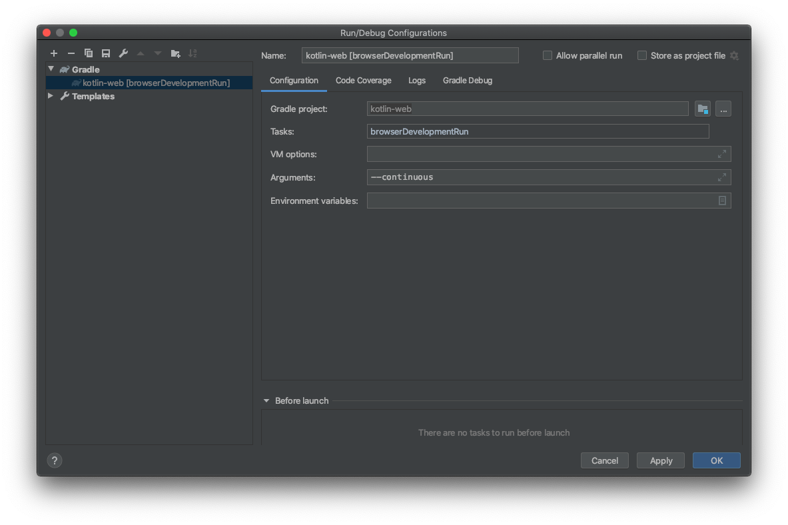

# Kotlin progresive web app

[](https://kotlinlang.org/) [](https://reactjs.org/) [](http://makeapullrequest.com) [](https://opensource.org/licenses/MIT)

Web App and PWA created using Kotlin

This repository is part of a learning excersise that includes working with Kotlin programming language in order to create a progresive web app

You can find the slides of presentation of this proyect [here](https://docs.google.com/presentation/d/1i6Zesc97qfyi4hsc_30FbNOIq4PcyTD1IdHMwUYRv9k/edit?usp=sharing)

 <!-- 

*If you're interested in knowing the powerlevel9k configuration to get this prompt, have a look at [this gist](https://gist.github.com/athityakumar/1bd5e9e24cd2a1891565573a893993eb).* -->

# Table of contents

- [kotlin-web](#kotlin-web)
- [Project configuration](#project-configuration)
- [Run development server](#run-development-server)
- [Run API development server](#run-api-development-server)
- [TODO](#TODO)
- [Contributing](#contributing)
- [License](#license)

# Project configuration
[(Back to top)](#table-of-contents)

Create a new gradle project in IntelliJ with the following configuration


# Run development server
[(Back to top)](#table-of-contents)

you can either run task named `browserDevelopmentRun` under other tasks or run `./gradlew run` on terminal

In order to configure continuous compiling development on IDE you can edit run configuration


or you can run `./gradlew run --continuous` on Terminal

# Run API development server
[(Back to top)](#table-of-contents)

In order to provide a basic development API, the project use [Spring Boot](https://spring.io/projects/spring-boot)

to start spring boot server:
1. Go to module paganinisoundsApi
2. run on terminal ` ./gradlew bootRun` 

you can also run from module application `paganinisoundsApi/src/main/kotlin/com/jyodroid/paganinisounds/PaganinisoundsApiApplication.kt` by running the main method

The servers run on ***localhost:8081*** so if you like use [ngrok](https://ngrok.com/) 
```
ngrok http 8081
``` 

# TODO
+ Play around
 -[ ] Styles
 -[ ] Webpack
 -[ ] Wrappers
 -[ ] Hooks
 -[ ] Debug
+ Try these tools
 -[ ] [Ktor](https://ktor.io/quickstart/index.html): framework to build connected applications 
+ How to Test?
+ Deploy to production [Heroku?](https://play.kotlinlang.org/hands-on/Building%20Web%20Applications%20with%20React%20and%20Kotlin%20JS/09_Deploying_to_Production)

# Contributing

[(Back to top)](#table-of-contents)

Your contributions are always welcome! :robot: Please have a look at the [contribution guidelines](CONTRIBUTING.md) first.

# License

[(Back to top)](#table-of-contents)

The MIT License (MIT) 2020 - [John Tangarife](https://github.com/jyodroid/). Please have a look at the [LICENSE](LICENSE) for more details.
